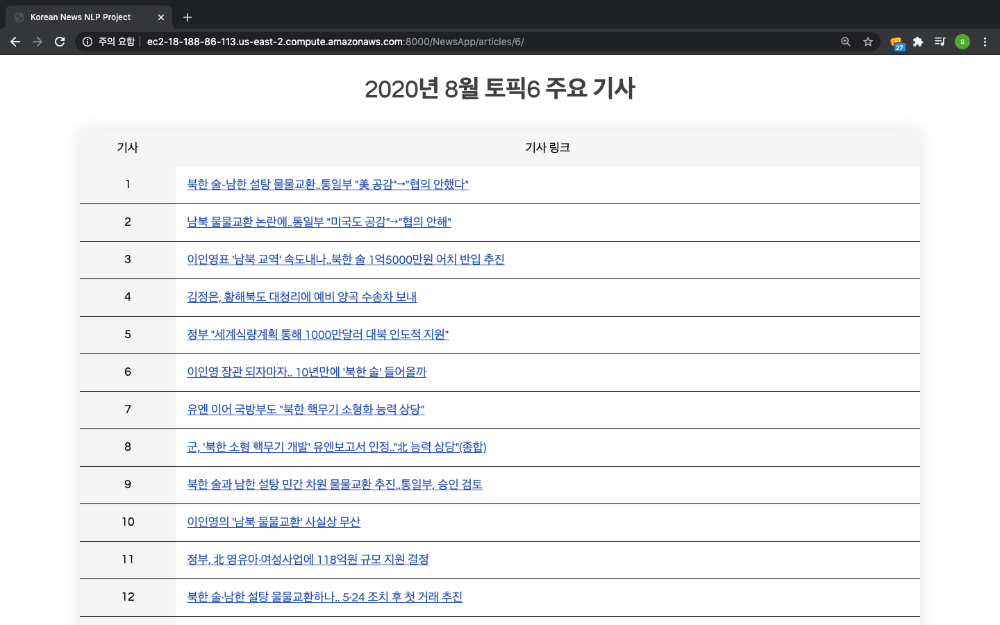

신문이나 포털에는 최신 토픽에 대한 최신 뉴스가 강조되어 나타나기 때문에, 특별한 노력이 없다면 과거 토픽들은 그저 쌓여있는 과거 뉴스들과 함께 잊혀지기 쉽습니다. 그래서 [빅카인즈](https://www.bigkinds.or.kr/v2/news/index.do)와 같이 키워드를 입력해서 과거의 기사들을 찾고 그 기사들에서 발견되는 연관 키워드들을 보여주는 서비스가 출시되었지만, 과거에 어떤 토픽이 있었는지 잊어버려서 정보가 없는 상태에서는 위와 같은 키워드 기반 검색도 불가능합니다. 해당 서비스에서는 사용자가 이미 과거의 특정 토픽에 대한 관심이 있어서 검색할 키워드를 갖고 있어야 하기 때문입니다.

이 프로젝트는 월 단위로 수집한 과거 뉴스 기사들에 머신러닝 기법을 적용하여 자동으로 월 별 주요 토픽을 찾아내고, 찾아낸 토픽별로 연관성이 높은 뉴스를 정리해서 보여주는 서비스를 제시합니다. 이를 통해 사용자는 과거의 특정 이슈에 대한 사전 정보 없이도 그 시대의 주요 토픽과 관련 기사들을 제공받을 수 있습니다. '이때 무슨 일이 있었지?'와 같은 일반적인 궁금증을 해소할 수 있으며, 나아가 자신이 관심을 가질만한 토픽과 이에 대한 키워드를 발견할 수 있어 보다 능동적인 뉴스 소비 방식을 경험할 수 있습니다. 

서비스는 (1) 데이터를 수집하고, (2) 이를 분석한 결과를 (3) 웹 페이지에 게시하는 과정으로 구성됩니다. 아래 지면을 통해서 각 요소들을 보다 구체적으로 설명합니다. 데이터 수집과 분석을 위해 사용된 패키지와 각 버전은 아래와 같았습니다.
```
ray==0.8.7
konlpy==0.5.2
gensim==3.8.3
pandas==1.1.2
```

# 1. 데이터 수집: 뉴스 수집 후 말뭉치 생성
`getcorpus.py`와 `getcorpus_serial.py`에는 특정 기간 동안 Daum에 게시된 특정 대분류(정치, 경제 등)에 해당하는 기사들의 목록을 획득하고, 목록 안의 각 기사에서 형태소 분석기를 통해 명사를 추출해 말뭉치를 생성하는 과정이 구현되어 있습니다. [Ray](https://docs.ray.io/en/latest/)라는 Python 코드 분산처리 패키지의 사용 여부에 따라 두 파일을 구분했습니다. 두 파일 모두 아래와 같은 인자들을 입력할 것을 요구합니다.
```
positional arguments:
  {y,n}               말뭉치 생성에 앞서 해당 기간 동안 게제된 기사들의 URL목록을 수집하는 작업의 실행 여부
                      파일을 처음 실행시킬 땐 이 목록이 없을 것이므로 y를 입력합니다.

optional arguments:
  -h, --help          도움말 출력
  -c , --category     기사들의 대분류. 입력하지 않고 파일을 실행시키면 입력 가능한 값들의 목록을 확인할 수 있습니다.
  -s , --start-date   기사를 수집할 기간의 시작 날짜(yyyymmdd 형식)
  -e , --end-date     기사를 수집할 기간의 마지막 날짜(yyyymmdd 형식)
```
예를 들어, 2020년 8월의 정치 기사들의 URL목록을 수집하면서 말뭉치를 생성하는 작업을 분산처리하는 명령어는 아래와 같습니다.
```
python getcorpus.py y -c politics -s 20200801 -e 20200831
```
두 파일 모두 디렉토리에 `dirs`라는 폴더를 생성하고, 그 안에 `대분류-시작날짜-종료날짜` 형식의 폴더를 만들어서 말뭉치를 바이너리 파일로 저장합니다. URL목록 수집을 하도록 명령어를 지정했으면 URL의 목록과 각 기사들의 제목이 txt파일로 저장됩니다. 

## 분산처리에 의한 성능 차이


같은 작업에 대한 각 파일의 소요 시간에는 큰 차이가 있었습니다. AWS의 t3.xlarge 인스턴스(4코어, 메모리 16GB) 기준으로, 위 작업을 분산처리했을 때는 약 16분이 소요되었지만 그렇지 않았을 때는 1시간이 소요되었습니다. 그렇기 때문에 CPU자원을 아껴야 하는 상황이 아니면 `getcorpus.py`를 통해 작업을 수행하는 것이 좋습니다. 현재는 코어 하나를 제외한 모든 자원을 사용하도록 설정되어 있습니다.

## 형태소 분석기 MeCab 설치
이 작업을 수행하기 위해 `konlpy.tag`의 `MeCab`이라는 형태소 분석기를 사용했습니다. 이 형태소 분석기를 사용하기 위해서는 `pip`을 통해 이 패키지를 다운받는 것에 더해 [공식 문서](https://konlpy-ko.readthedocs.io/ko/v0.4.3/install/)에 나와 있는 명령어를 추가로 수행해 `MeCab`을 다운받아야 합니다.

# 2. 데이터 분석: LDA를 활용한 토픽 모델링
뉴스 데이터의 토픽을 찾아내는 머신러닝 기법으로 LDA를 선택한 이유는 아래와 같습니다.

1. LDA는 비지도학습 기법이다(즉, 토픽이 미리 정해져있지 않아도 모델이 데이터를 통해 자동으로 토픽을 찾아낸다).
2. 널리 사용되고 인정받는 패키지가 LDA 적합을 위해 구현되어 있다.

LDA는 말뭉치를 입력받아 미리 정해놓은 개수만큼 토픽을 생성합니다. 이때, 사용자가 토픽 개수만큼 스크롤을 내려야 하므로 토픽 개수를 너무 많이 설정하면 사용자의 피로감이 증가할 거라고 생각했습니다. 그래서 현재는 토픽 개수를 20개로 설정하고, 각 토픽을 클릭했을 때 그 토픽에 할당될 확률이 제일 높은 상위 20개 기사들의 목록이 보이도록 했습니다. 예를 들어, 앞서 확보한 2020년 8월의 말뭉치를 가지고 20개의 토픽을 추출해 그 결과를 적재하는 명령어는 아래와 같습니다. 
```
python estimate.py y -c politics -s 20200801 -e 20200831 -k 20 -na 20 -nv 20
```

## 한계점



아직 부족한 점은 토픽이 세부적으로 분류되지 않고 있다는 것입니다. 위에 첨부한 2020년 8월의 예시를 보면, 각 기사들이 공통적으로 북한과 관련된 주제를 담고 있습니다. 하지만 자세히 보면 '대북 교류 제안'과 '증가하는 북한의 군사적 위협'이라는 두 상반된 주제가 한 토픽에 할당된 것을 확인할 수 있습니다. 결국 기사들의 대분류를 생성하는 데까지는 성공했지만, 아직 사용자가 만족할 만한 수준으로 이슈를 세세하게 분류하는 데까지는 나아가지 못했습니다.

이를 해결하기 위한 아래와 같은 방법들을 생각했습니다. 
1. LDA를 validate하는 데 사용되는 log perplexity에 기반해 토픽 개수를 계속 늘려보며 최적의 토픽 개수를 정해볼 수 있습니다. 이 경우, 실제 서비스에는 어떤 토픽을 노출시켜야 할지는 추가로 고민해봐야 합니다.
2. 여러 토픽이 혼합돼서 한 문서가 생성된다는 LDA의 가정대로, 여러 토픽을 조합해 하나의 세부 주제를 만들고, 이 세부 주제를 기준으로 기사들을 노출시키는 방법이 있습니다. 이를 위해 기사들을 토픽 별 할당 확률 벡터를 기준으로 한번 더 clustering하는 방법을 생각해 보고 있습니다.
